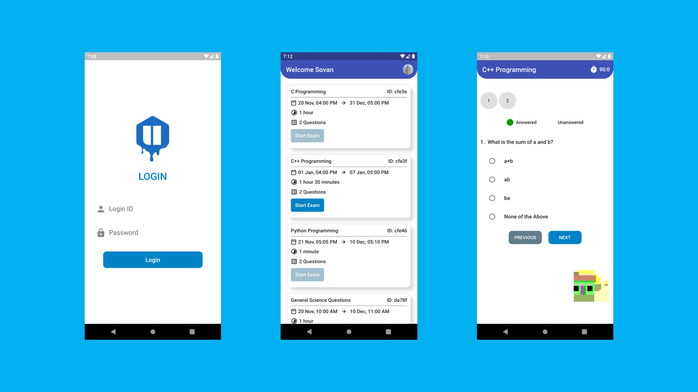
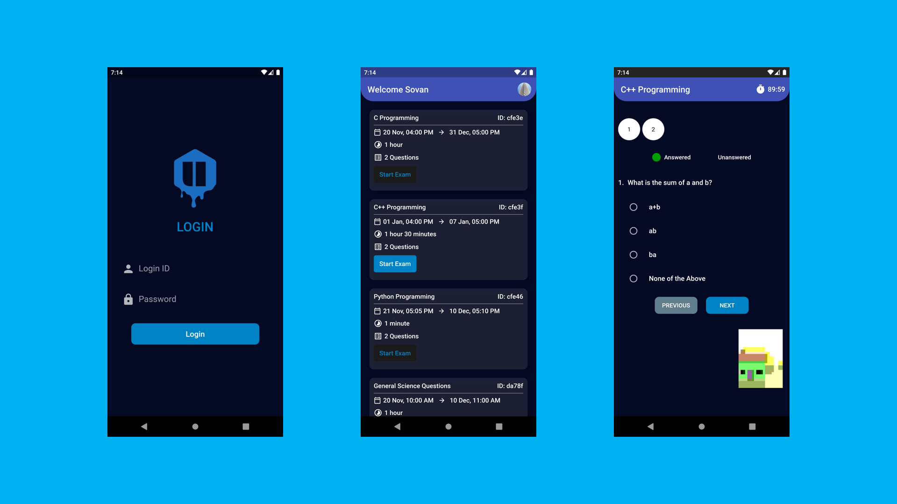
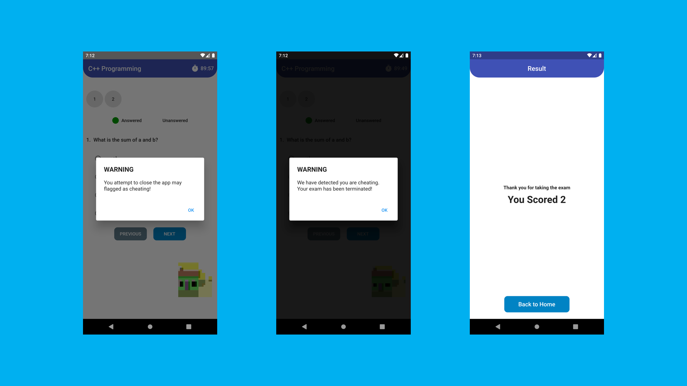

# Ujian

An App that aims to stop cheating in online exams with the power of AIML.

## Features and Interfaces

1. Login Page
   - Login with the provided user id and password

2. Home page
   - Shows all the exams assigned to the user
   - The user can start an exam only on the correct timeslot
   - Logout through user popup menu in the app bar

3. Exam Page
   - The user can answer MCQ-based questions
   - The user can also view their progress

    Light Theme:-
   
    
   
    Dark Theme:-
    
    

7. AI-powered face motion detector
   - We've used Google's on-device `ml-kit` to track the motion of the user's face.
   - We can check if a user is trying to cheat by monitoring the position of their face

    

## Technology Used

#### Frontend
- Flutter
- MobX + Provider

#### Backend
- Nodejs
- Express
- MongoDB

#### Other Tools
- Google's on-device ML Kit

## Backend Repository Link

- [Backend Repository](https://github.com/sovanmondal182/exam_app_backend)
